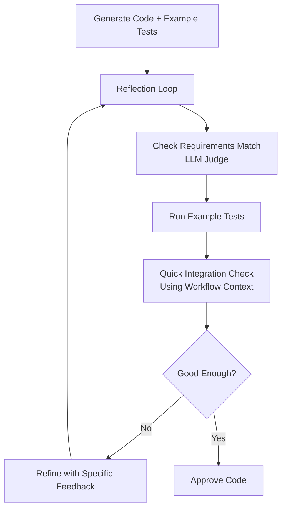

# End-to-End Implementation Plan
## Skill Registry + Deterministic Coding Agent + Dynamic Agent Composer

**Version**: 1.0  
**Date**: June 25, 2026  
**Goal**: Build a production-grade system that allows business teams to provide workflow documents, which are dynamically turned into reliable hybrid (deterministic + LLM) agents using governed skills from a central registry.

---

## 1. System Overview

### Core Capabilities
- **Skill Registry**: Centralized, versioned, searchable storage for skills (instructions + executable assets).
- **Deterministic Coding Agent**: Specialized agent that converts skills into high-quality, validated Python code for deterministic execution.
- **Agent Composer**: Takes workflow documents + skills and dynamically builds executable LangGraph agents (hybrid nodes).
- **Execution Runtime**: Runs composed agents with persistence, observability, and reliability.

### Key Principles
- Clean Architecture (Domain → Application → Infrastructure)
- Default to deterministic for reliability and cost control
- **Pragmatic, human-like validation**: Lightweight, example-based testing and quick integration checks (inspired by how developers manually test code)
- Strong sandboxing and safety for generated code
- Progressive disclosure and dynamic loading
- Production-ready from day one (caching, versioning, observability)

---

## 2. High-Level Architecture

```
Business Users
     ↓ (Workflow Documents)
Agent Composer
     ├── Workflow Parser
     ├── Skill Mapper (→ Skill Registry)
     ├── Hybrid Node Decider (backlog)
     └── Deterministic Coding Agent (for deterministic nodes)
          ↓
     LangGraph Builder
          ↓
Executable Hybrid Agent (StateGraph)
          ↓
Execution Runtime + Persistence + Observability
```

**Core Services**:
- `SkillRegistry`
- `DeterministicCodingAgent`
- `AgentComposer`

---

## 3. Phased Implementation Plan

### Phase 0: Project Setup & Clean Architecture Foundations (1-2 days)

**Goals**: Establish clean layered structure and basic tooling.

**Steps**:
1. Create project structure:
   ```
   skill_registry_system/
   ├── domain/
   ├── application/
   ├── infrastructure/
   ├── interfaces/
   ├── tests/
   └── config.py
   ```
2. Set up Poetry / uv for dependency management.
3. Install core dependencies:
   - `fastapi`, `sqlalchemy`, `pydantic`, `langgraph`, `langchain`
   - `psycopg[binary]`, `pgvector`, `redis`
   - `pytest`, `mypy`, `ruff`

**Code Snippet: Basic Project Structure**
```bash
mkdir -p skill_registry_system/{domain,application,infrastructure,interfaces}
touch skill_registry_system/{domain/__init__.py,application/__init__.py,...}
```

---

### Phase 1: Skill Registry (Core Foundation) — 4-5 days

**Goals**: Fully functional, Postgres-backed skill registry with CRUD, versioning, semantic search, and caching.

#### 1.1 Domain Layer

**File**: `domain/entities.py`

```python
from dataclasses import dataclass
from datetime import datetime
from typing import Optional, Dict, Any
from uuid import UUID

@dataclass
class Skill:
    id: UUID
    name: str
    namespace: str = "default"
    description: str
    owner_id: str
    created_at: datetime
    status: str = "active"

@dataclass
class SkillRevision:
    id: UUID
    skill_id: UUID
    version: str
    metadata: Dict[str, Any]
    package_key: str          # S3/MinIO path
    checksum: str
    embedding: Optional[list[float]] = None
    created_at: datetime
    is_latest: bool = False
```

**File**: `domain/repositories.py`

```python
from abc import ABC, abstractmethod
from typing import List, Optional
from domain.entities import Skill, SkillRevision

class ISkillRepository(ABC):
    @abstractmethod
    def create_skill(self, skill: Skill, revision: SkillRevision) -> SkillRevision: ...
    @abstractmethod
    def get_latest_revision(self, name: str, namespace: str) -> Optional[SkillRevision]: ...
    @abstractmethod
    def semantic_search(self, query: str, limit: int = 10) -> List[SkillRevision]: ...
    @abstractmethod
    def list_revisions(self, skill_id: UUID) -> List[SkillRevision]: ...
```

#### 1.2 Infrastructure Layer

**File**: `infrastructure/postgres_repository.py`

```python
from sqlalchemy import create_engine, text
from pgvector.sqlalchemy import Vector
# ... (full implementation with SQLAlchemy 2.0 + pgvector)

class PostgresSkillRepository(ISkillRepository):
    def __init__(self, db_url: str):
        self.engine = create_engine(db_url)

    def semantic_search(self, query: str, limit: int = 10):
        # Use pgvector cosine similarity
        sql = text("""
            SELECT * FROM skill_revisions 
            ORDER BY embedding <=> :query_embedding 
            LIMIT :limit
        """)
        # Execute and map to entities
        ...
```

**File**: `infrastructure/cache.py`

```python
import redis
from typing import Any, Optional

class RedisCache:
    def __init__(self, redis_url: str):
        self.client = redis.from_url(redis_url)

    def get(self, key: str) -> Optional[Any]:
        return self.client.get(key)

    def set(self, key: str, value: Any, ttl: int = 3600):
        self.client.setex(key, ttl, value)
```

#### 1.3 Application Layer

**File**: `application/skill_registry.py`

```python
from domain.repositories import ISkillRepository
from infrastructure.cache import RedisCache
from infrastructure.storage import ObjectStorage

class SkillRegistry:
    def __init__(self, repo: ISkillRepository, cache: RedisCache, storage: ObjectStorage):
        self.repo = repo
        self.cache = cache
        self.storage = storage

    def create_skill(self, name: str, description: str, package_bytes: bytes, metadata: dict):
        package_key = self.storage.upload(package_bytes)
        # Create Skill + SkillRevision with embedding
        revision = self.repo.create_skill(...)
        self.cache.invalidate(f"skill:{name}")
        return revision

    def search_skills(self, query: str, limit: int = 10):
        cache_key = f"search:{query}"
        if cached := self.cache.get(cache_key):
            return cached
        results = self.repo.semantic_search(query, limit)
        self.cache.set(cache_key, results)
        return results
```

#### 1.4 API Layer

**File**: `interfaces/api/skills.py` (FastAPI)

```python
from fastapi import APIRouter, UploadFile
from application.skill_registry import SkillRegistry

router = APIRouter()

@router.post("/skills")
async def create_skill(file: UploadFile, registry: SkillRegistry = Depends(...)):
    content = await file.read()
    return registry.create_skill(...)
```

**Implementation Steps**:
1. Set up PostgreSQL + pgvector extension.
2. Create tables and migrations (Alembic).
3. Implement `PostgresSkillRepository`.
4. Add Redis caching layer.
5. Build `SkillRegistry` service.
6. Expose CRUD + semantic search APIs.
7. Add MinIO/S3 storage adapter.

---

### Phase 2: Deterministic Coding Agent — 5-6 days

**Goal**: Specialized agent that reliably converts skills into validated deterministic Python code.

#### 2.1 Domain Models

**File**: `domain/coding.py`

```python
from dataclasses import dataclass
from typing import List, Dict

@dataclass
class GeneratedCode:
    function_code: str
    test_code: str
    validation_report: Dict
    confidence_score: float
    iterations: int
```

#### 2.2 Coding Agent Implementation

**File**: `application/deterministic_coding_agent.py`

```python
from domain.entities import SkillRevision
from infrastructure.sandbox import CodeSandbox

class DeterministicCodingAgent:
    def __init__(self, sandbox: CodeSandbox, llm_client):
        self.sandbox = sandbox
        self.llm = llm_client

    def generate(self, skill_revision: SkillRevision) -> GeneratedCode:
        analysis = self._analyze_skill(skill_revision)
        
        if analysis["has_existing_code"]:
            return self._wrap_existing_code(skill_revision)
        
        plan = self._create_implementation_plan(skill_revision)
        code, tests = self._generate_code_and_tests(skill_revision, plan)
        
        for attempt in range(3):
            result = self.sandbox.run_tests(code, tests)
            if result.success:
                break
            code, tests = self._fix_code(code, tests, result.errors)
        
        validation = self._semantic_validation(skill_revision, code)
        return GeneratedCode(code, tests, validation, ...)
```

**Key Methods to Implement**:
- `_analyze_skill()`
- `_create_implementation_plan()`
- `_generate_code_and_tests()` (structured LLM call)
- `_fix_code()` (iterative repair)
- `_semantic_validation()`

#### 2.3 Sandbox for Safe Execution

**File**: `infrastructure/sandbox.py`

Use `RestrictedPython` or Docker-based isolated executor.

---

### Phase 3: Agent Composer — 4-5 days

**Goal**: Dynamically compose hybrid agents from workflow documents.

#### 3.1 Main Composer Service

**File**: `application/agent_composer.py`

```python
from application.skill_registry import SkillRegistry
from application.deterministic_coding_agent import DeterministicCodingAgent
from infrastructure.langgraph_builder import LangGraphBuilder

class AgentComposer:
    def __init__(self, registry: SkillRegistry, coding_agent: DeterministicCodingAgent, graph_builder: LangGraphBuilder):
        self.registry = registry
        self.coding_agent = coding_agent
        self.graph_builder = graph_builder

    def compose_from_workflow(self, workflow_doc: dict) -> ComposedAgent:
        steps = self._parse_workflow(workflow_doc)
        
        nodes = []
        for step in steps:
            skill = self.registry.get_skill(step["skill_name"])
            
            if self._should_be_deterministic(step, skill):
                func = self.coding_agent.generate(skill)
                nodes.append(("deterministic", func))
            else:
                nodes.append(("llm_agent", skill))
        
        graph = self.graph_builder.build(nodes, workflow_doc.get("conditions", {}))
        return ComposedAgent(graph=graph, ...)
```

#### 3.2 Workflow Parser

Support YAML + basic natural language parsing.

#### 3.3 LangGraph Builder

**File**: `infrastructure/langgraph_builder.py`

```python
from langgraph.graph import StateGraph

class LangGraphBuilder:
    def build(self, nodes: list, conditions: dict):
        graph = StateGraph(MessagesState)
        for name, node in nodes:
            if isinstance(node, str):  # LLM agent
                graph.add_node(name, self._create_llm_node(node))
            else:
                graph.add_node(name, node)  # deterministic function
        # Add edges and conditional routing
        return graph.compile()
```

---

### Phase 4: Execution Runtime & Persistence — 3 days

- Use LangGraph checkpoints (Postgres or Redis).
- Add observability (LangSmith or OpenTelemetry).
- Create execution API endpoint.

---

### Phase 5: Validation, Testing & Hardening — Ongoing

- Comprehensive test suite for all layers.
- Sandbox security hardening.
- Monitoring & alerting for generated code.
- Human review workflow for high-stakes skills.

---

## 4. Key Data Models Summary

- `Skill` + `SkillRevision`
- `Workflow` + `WorkflowStep`
- `ComposedAgent`
- `GeneratedCode`
- `NodeDecision` (for future Hybrid Node Decider)

---

## 5. Recommended Tech Stack

| Layer              | Technology                          |
|--------------------|-------------------------------------|
| API                | FastAPI                             |
| Database           | PostgreSQL + pgvector               |
| Cache              | Redis                               |
| Object Storage     | MinIO                               |
| Agent Framework    | LangGraph                           |
| LLM                | Any (via LangChain)                 |
| Sandbox            | RestrictedPython / Docker           |
| Testing            | pytest + testcontainers             |
| Migrations         | Alembic                             |

---

## 6. Implementation Roadmap (Prioritized)

1. **Week 1-2**: Phase 0 + Phase 1 (Skill Registry complete)
2. **Week 3**: Phase 2 (Deterministic Coding Agent MVP)
3. **Week 4**: Phase 3 (Agent Composer basic flow)
4. **Week 5**: Phase 4 + Integration testing
5. **Week 6+**: Hardening, observability, advanced features (Hybrid Node Decider)

---

## 7. Simplified Human-Inspired Validation Strategy (for Deterministic Coding Agent)

**Important Update**: We are adopting a **pragmatic, lightweight validation approach** inspired by how human developers work, rather than building heavy multi-layer automated validation inside every Reflection iteration.

### Why We Simplified
- The system generates code **dynamically on-the-fly** based on workflow + skill.
- Heavy validation (full mini-graph simulation every iteration) adds too much complexity and latency.
- Human developers typically do **lightweight, targeted testing** using examples and quick mental simulation.

### Recommended Validation Approach

| Validation Layer          | How It's Done (Human-like)                          | Automation Level | Runs Inside Reflection? | Notes |
|---------------------------|-----------------------------------------------------|------------------|--------------------------|-------|
| **Example-based Testing** | Generate and run 3–5 tests using examples from skill or workflow | High             | Yes                      | Core method |
| **Functional Correctness**| LLM-as-Judge comparing code behavior to skill description + workflow step | Medium           | Yes                      | Focused critique |
| **Quick Integration Check**| Feed sample output from previous step → check if output format works for next step | Medium           | Yes                      | Lightweight simulation |
| **Determinism & Safety**  | Run twice with same input + basic static analysis   | High             | Yes                      | Basic checks |
| **Full Integration**      | Done after full agent composition (optional)        | Medium           | No                       | Post-composition stage |

### Validation Flow Inside Reflection (Simplified)



### Key Changes from Earlier Heavy Approach
- Removed complex multi-layer validation engine inside every iteration.
- Focus on **example-based testing** + **quick context-aware checks**.
- Move deeper integration testing to **after agent composition**.
- Keep Reflection focused on requirements matching and code quality.

This approach is:
- Much simpler to implement
- Faster and more cost-efficient
- Closer to real engineering practice
- Still provides good quality gates

---

## 8. Backlog Items

- Full Hybrid Node Decider with scoring model
- Advanced workflow document formats (BPMN, natural language)
- Hierarchical sub-agent support
- UI for Agent Builder
- Multi-tenancy & RBAC
- Advanced property-based testing for generated code

---

**This document serves as the living implementation plan.** Update it as development progresses.

---

*End of Plan*