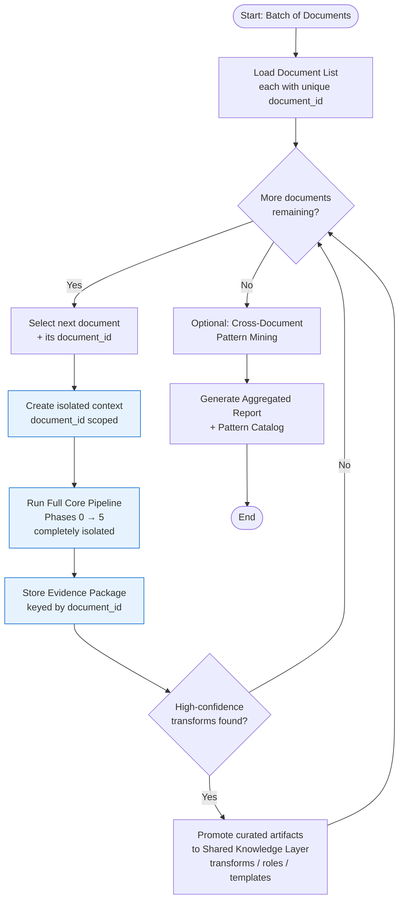
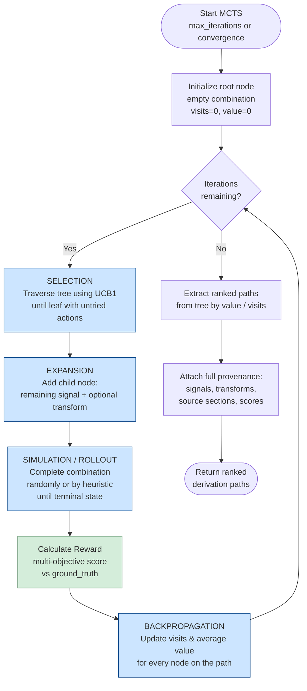
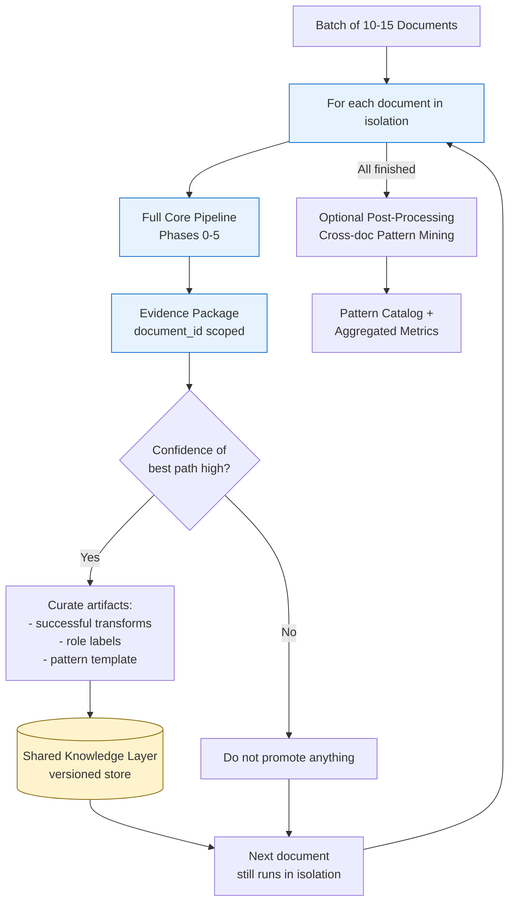

# End-to-End Implementation Plan  
## Reverse-Engineering Entity Extraction from Wholesale Credit Agreements

**Target Example**  
- Entity: `risk-type`  
- Ground Truth: `cITCO- high risk`  

**Scope**  
- Supports **1 document** or a batch of **10–15 documents**
- Same `entity_name` can appear across documents with different or identical ground-truth values

**Goal**  
Build a controllable, hybrid (deterministic + LLM) system that:  
1. Ingests one or more credit agreement `.txt` files  
2. Performs a linear section-by-section analysis **per document**  
3. Builds a traversable graph/tree **per document**  
4. Uses the target entity + ground-truth value to retrieve relevant signals **per document**  
5. Explores and scores combinations of sub-level entities using MCTS **per document**  
6. Reconstructs the most probable derivation path that produced the ground-truth value **per document**  
7. Keeps documents strictly isolated so that results from one document cannot affect another  

**Core Multi-Doc Rule (Non-Negotiable)**  
Each document is processed completely independently.  
No raw signals, intermediate combinations, MCTS state, or evidence from Document A may influence Document B during retrieval or search.  
Only curated, high-confidence artifacts (transform rules, role vocabulary, pattern templates) may be optionally promoted to a shared knowledge layer **after** a document finishes.

This plan follows the exact human process you described and turns it into a production-ready, agentic pipeline.

---

## 1. High-Level Architecture

### 1.1 Multi-Document Orchestration (Batch of 10–15 docs)



**Isolation Guarantee**: Every graph node, signal, MCTS node, and evidence package is tagged with `document_id`. All retrieval and search operations are filtered by it. Cross-document influence is impossible during the core pipeline.

### 1.2 Single Document Core Pipeline (Detailed)

```mermaid
flowchart TD
    A[Input: Credit Agreement .txt<br/>+ document_id] --> B[Phase 0: Input Preparation]
    B --> B1[Normalize text]
    B1 --> B2[Attach document_id<br/>to all subsequent artifacts]
    
    B2 --> C[Phase 1: Linear Section-by-Section Pass]
    C --> C1[Detect hierarchical headings]
    C1 --> C2[Split into sections / subsections]
    C2 --> C3[For each section:<br/>Generate short analysis note]
    C3 --> C4[Extract preliminary signals]
    C4 --> C5[Attach metadata:<br/>section_id, level, spans, analysis]
    
    C5 --> D[Phase 2: Graph / Tree Construction]
    D --> D1[Build hierarchy tree<br/>parent-child from outline]
    D1 --> D2[Add cross-reference edges<br/>defined terms, schedules]
    D2 --> D3[Compute embeddings<br/>for every node]
    D3 --> D4[Store graph scoped<br/>to document_id]
    
    D4 --> E[Phase 3: Entity + Ground-Truth Retrieval]
    E --> E1[Build query from<br/>entity_name + ground_truth]
    E1 --> E2[Nearest-neighbour search<br/>+ BM25 / keyword]
    E2 --> E3[Hierarchical boost<br/>risk-related parents]
    E3 --> E4[Prune irrelevant nodes]
    E4 --> E5[Extract sub-entity candidates<br/>with roles & confidence]
    
    E5 --> F[Phase 4: MCTS Combination Search]
    F --> F1[Initialize MCTS root<br/>empty combination]
    F1 --> F2[Run MCTS iterations]
    F2 --> F3[Extract ranked paths<br/>from search tree]
    
    F3 --> G[Phase 5: Evidence Package]
    G --> G1[Reconstructed string]
    G1 --> G2[Sub-entities + source sections]
    G2 --> G3[Transforms applied]
    G3 --> G4[Score breakdown + explanation]
    G4 --> H[Output: Document-scoped<br/>Evidence Package]
    
    style B2 fill:#fff3cd,stroke:#856404
    style D4 fill:#fff3cd,stroke:#856404
    style H fill:#d4edda,stroke:#155724
```



---

## 2. Detailed End-to-End Flow

### Phase 0 – Input Preparation
- Input: one or more full documents as plain text (`.txt`)
- **Required metadata**: `document_id` (unique per document – used for strict isolation)
- Optional metadata: bank, facility type, date
- Normalize: remove excessive whitespace, preserve original headings and paragraph boundaries
- When processing a batch, each document is handed to the core pipeline independently with its own `document_id`

### Phase 1 – Linear Section-by-Section Pass
**Objective**: Walk the document from first heading to last paragraph and produce a short analysis for every meaningful unit.

**Steps**:
1. Detect hierarchical structure (Heading 1 → Heading 2 → … → paragraphs)
2. For each section / subsection:
   - Extract title + full text span
   - Generate a short analysis note (3–6 sentences) that answers:
     - What is this section about?
     - Does it contain any risk-related language, administrator names, classifications, or defined terms?
     - Any potential sub-entities that could later contribute to a composite value?
3. Attach metadata to each unit:
   - `section_id`
   - `level` (1, 2, 3…)
   - `start_char` / `end_char`
   - `short_analysis`
   - `raw_text`
   - `preliminary_signals` (list of candidate phrases)

**Implementation note**:  
Use a hybrid approach — deterministic heading detection + LLM for the short analysis note (with a strict system prompt that forces concise, factual output).

### Phase 2 – Graph / Tree Construction
**Objective**: Turn the linear analysis into a traversable structure.

**Recommended structure**:
- **Primary**: Tree (parent–child hierarchy mirrors document outline)
- **Secondary**: Lightweight graph edges for cross-references (defined terms, “see Schedule X”, “as defined in Section Y”)

**Node schema**:
```json
{
  "id": "sec_3_2_1",
  "title": "Risk Classification",
  "level": 3,
  "parent_id": "sec_3_2",
  "short_analysis": "...",
  "raw_text": "...",
  "signals": ["high risk", "Citco", ...],
  "embedding": [0.12, -0.45, ...],
  "relevance_score": null
}
```

**Storage options**:
- In-memory NetworkX / igraph for prototyping
- Postgres + recursive CTEs or Apache AGE / Neo4j for production
- Vector index (pgvector / FAISS) on the `embedding` field for nearest-neighbour search

### Phase 3 – Entity + Ground-Truth Nearest-Neighbour Retrieval
**Inputs**:
- Target entity name (`risk-type`)
- Ground-truth value (`cITCO- high risk`)

**Process**:
1. Embed the query: `"risk-type" + "cITCO- high risk"` (or separate embeddings + weighted combination)
2. Retrieve top-k nodes from the graph using:
   - Semantic similarity (embedding cosine)
   - Keyword overlap (BM25 or simple token match)
   - Hierarchical boost (prefer nodes closer to risk-related parent sections)
3. Rank and prune nodes that clearly cannot contribute
4. Extract all candidate **sub-level entities** from the surviving nodes

**Output of this phase**:  
A ranked list of candidate signals, each carrying:
- Source node ID
- Extracted text span
- Confidence / similarity score
- Suggested role (e.g. “administrator”, “risk_level”, “prefix”, “connector”)

### Phase 4 – Combination Exploration & Scoring
**Algorithm of choice**: **Monte Carlo Tree Search (MCTS)**

**Why MCTS**:
- Excellent balance of exploration vs exploitation when the space of signal combinations + transforms grows
- Naturally handles variable-depth paths and optional transformations
- Produces a search tree that can be inspected (aligns with explicit, controllable design)
- Reward can be the same multi-objective score used for ranking final paths
- Works well as a LangGraph node or hybrid agent component
- Scales better than pure beam search when many candidate signals or transform variants exist

**Scoring / Reward function (multi-objective)**:
```
reward = w1 * string_similarity(combined, ground_truth)
       + w2 * token_coverage(combined, ground_truth)
       + w3 * semantic_similarity(combined, ground_truth)
       + w4 * source_quality (average node relevance)
       - w5 * complexity_penalty (number of signals + transform complexity)
```

**Transforms allowed inside the search**:
- Case normalization (`CITCO` → `cITCO`)
- Concatenation patterns (`A + "-" + B`, `A + "- " + B`, etc.)
- Light cleaning (remove extra spaces, standardize hyphens)
- Optional LLM-proposed transforms (only when deterministic rules fail)

**MCTS loop (classic 4 steps)**:
1. **Selection**  
   Starting from the root (empty combination), traverse the tree using UCB1 (or a variant) to select the most promising leaf that still has unexplored actions.

2. **Expansion**  
   From the selected node, add one or more child nodes by applying a remaining signal + optional transform.

3. **Simulation (Rollout)**  
   From the new child, perform a lightweight rollout (random or heuristic completion of the combination) until a terminal state (max signals reached or no useful signals left). Evaluate the final combination with the reward function above.

4. **Backpropagation**  
   Propagate the reward back up the path, updating visit counts and average values for every node on the path.

**Termination & Output**:
- Run a fixed number of iterations (e.g. 500–5000 depending on signal count) or until convergence
- After search, extract the highest-value paths from the tree
- Return ranked final combinations with full provenance (signals used, transforms, source sections, visit statistics)

### Phase 5 – Output & Evidence Package
For every high-scoring combination produce:
- Final reconstructed string
- List of sub-entities used (with source sections)
- Exact transforms applied
- Overall score + breakdown
- Human-readable derivation narrative
- Confidence that this path explains the ground truth

---

## 3. Detailed Flow Diagrams

### 3.1 Complete Per-Document Pipeline (Phases 0–5)

```mermaid
flowchart TD
    subgraph P0 [Phase 0: Input Preparation]
        A0[Raw .txt] --> A1[Normalize whitespace]
        A1 --> A2[Assign document_id]
        A2 --> A3[Ready for processing]
    end

    subgraph P1 [Phase 1: Linear Section Pass]
        B0[Start at first heading] --> B1[Detect next heading / paragraph boundary]
        B1 --> B2[Extract title + text span]
        B2 --> B3[LLM: Write short analysis note]
        B3 --> B4[Extract preliminary signals]
        B4 --> B5{More sections?}
        B5 -->|Yes| B1
        B5 -->|No| B6[All sections analyzed]
    end

    subgraph P2 [Phase 2: Graph Construction]
        C0[Create root node] --> C1[Add section nodes<br/>with parent-child links]
        C1 --> C2[Detect & add cross-reference edges]
        C2 --> C3[Embed every node]
        C3 --> C4[Persist graph under document_id]
    end

    subgraph P3 [Phase 3: Retrieval]
        D0[Form query:<br/>entity_name + ground_truth] --> D1[Vector search + BM25]
        D1 --> D2[Apply hierarchical boost]
        D2 --> D3[Rank & prune nodes]
        D3 --> D4[Pull sub-entity candidates<br/>text, role, confidence, span]
    end

    subgraph P4 [Phase 4: MCTS]
        E0[Root = empty combination] --> E1[MCTS Main Loop]
        E1 --> E2[Extract top paths]
    end

    subgraph P5 [Phase 5: Evidence Package]
        F0[For each high-value path] --> F1[Reconstructed string]
        F1 --> F2[List sub-entities + sources]
        F2 --> F3[Transforms used]
        F3 --> F4[Score + human explanation]
        F4 --> F5[Package keyed by document_id]
    end

    A3 --> B0
    B6 --> C0
    C4 --> D0
    D4 --> E0
    E2 --> F0
```



### 3.2 MCTS Internal Loop (Detailed)



### 3.3 Multi-Document Isolation & Shared Knowledge



---

## 4. Component Design (Hybrid Agent Friendly)

| Component                    | Type              | Technology Suggestion                  | Notes |
|-----------------------------|-------------------|----------------------------------------|-------|
| Section Splitter            | Deterministic     | Regex + heading heuristics             | Fast, reliable |
| Short Analysis Generator    | LLM               | Structured output / JSON mode          | Strict prompt |
| Graph Builder               | Deterministic     | NetworkX / custom tree                 | Easy to serialize |
| Embedding & Retrieval       | Hybrid            | pgvector + BM25                        | Production ready |
| MCTS Engine                 | Deterministic     | Pure Python / LangGraph node           | Fully controllable, exploration-aware |
| Transform Proposer          | Optional LLM      | Only when needed                       | Keep hybrid |
| Scoring Function            | Deterministic     | Weighted multi-objective               | Tunable |
| Orchestrator                | State Machine     | LangGraph                              | Matches your preference |

---

## 5. Data Contracts

**Sub-Entity Candidate**
```json
{
  "id": "sig_017",
  "text": "Citco",
  "normalized": "cITCO",
  "role_hypothesis": ["administrator", "prefix"],
  "source_node": "sec_4_1_2",
  "similarity_to_gt": 0.71,
  "span": [12450, 12455]
}
```

**Combination Result**
```json
{
  "rank": 1,
  "reconstructed": "cITCO- high risk",
  "score": 0.94,
  "sub_entities": ["sig_017", "sig_023"],
  "transforms": ["case_normalize(Citco → cITCO)", "concat(A + '- ' + B)"],
  "provenance": ["sec_4_1_2", "sec_7_3"],
  "explanation": "Administrator name from Section 4.1.2 normalized to cITCO + risk classification 'high risk' from Section 7.3 concatenated with hyphen-space."
}
```

---

## 6. Implementation Roadmap

**Sprint 1 – Foundation (1–2 weeks)**  
- Section splitter + short analysis generator  
- Basic tree construction  
- Simple embedding + retrieval  

**Sprint 2 – Core Search (1–2 weeks)**  
- Candidate extraction  
- MCTS engine + multi-objective reward function  
- Transform library (case, concat, clean)  
- UCB1 selection + rollout policy  

**Sprint 3 – Hybrid & Production (1–2 weeks)**  
- LangGraph orchestration  
- Cross-reference graph edges  
- Evidence package generation  
- Evaluation harness (compare reconstructed vs ground truth)  

**Sprint 4 – Hardening & Multi-Doc**  
- Caching, versioning of graphs  
- Human-in-the-loop review UI  
- Multi-document batch runner with strict document_id isolation  
- Shared knowledge layer (transforms & pattern templates only)  
- Cross-doc pattern mining (post-processing)  

---

## 7. Evaluation Metrics

- Exact match rate of top-1 reconstructed string vs ground truth  
- Token-level F1 of the combination  
- Rank of the correct derivation path  
- Average number of signals needed  
- Human judgment of explanation quality  

---

## 8. Multi-Document Handling (10–15 docs)

The core pipeline remains **per-document**. Results from one document must **not** leak into another document’s graph, retrieval, or MCTS search. This prevents contamination when the same entity has different values (or even the same value) across documents.

### 8.1 Core Principle: Strict Isolation by Default

```
For each document D independently:
    1. Build its own section graph/tree
    2. Run its own nearest-neighbour retrieval for (entity_name, ground_truth_value)
    3. Run its own MCTS combination search
    4. Produce its own ranked derivation paths + evidence package
```

- Each document gets a completely separate graph.
- MCTS state, visit counts, and rewards stay local to that document.
- No raw signals or intermediate combinations from Doc A are visible to Doc B during search.

### 8.2 What Can Be Shared (Controlled & Optional)

Only after a document has finished its full pipeline may selected artifacts be promoted to a **shared knowledge layer**:

| Shared Artifact                    | Purpose                                      | When to share                          | Risk if shared carelessly |
|------------------------------------|----------------------------------------------|----------------------------------------|---------------------------|
| Normalized transform rules         | Reuse successful case/concat patterns        | After high-confidence success          | Low                       |
| Role vocabulary (admin, risk_level)| Consistent labeling of sub-entities          | After multiple docs agree              | Low                       |
| Common derivation pattern templates| Detect recurring structures across docs      | Post-processing only                   | Medium                    |
| Aggregate statistics               | Frequency of certain casings, connectors     | Analytics / reporting                  | Low                       |
| Raw signals or section text        | —                                            | **Never**                              | High (contamination)      |

### 8.3 Handling Same Entity, Different / Same Values

- **Different ground-truth values** for the same `entity_name` across docs  
  → Treat each `(document_id, entity_name, ground_truth_value)` triple as an independent reverse-engineering task.  
  → No influence between them.

- **Same ground-truth value** appearing in multiple docs  
  → Still run independent pipelines.  
  → After all runs finish, a separate **pattern mining** step can cluster similar derivation paths and surface common templates (for human review or for improving the shared transform library).

### 8.4 Multi-Doc Orchestration Flow

See the detailed diagrams in **Section 1.1** (Multi-Document Orchestration) and **Section 3.3** (Multi-Document Isolation & Shared Knowledge).

Summary of the flow:
1. Outer loop iterates over each document with its unique `document_id`
2. Full core pipeline (Phases 0–5) runs in complete isolation
3. Evidence package is stored scoped to that `document_id`
4. Only after success may curated transforms / patterns be promoted to the Shared Knowledge Layer
5. After all documents finish, optional cross-document pattern mining can be run

### 8.5 Implementation Recommendations

1. **Document isolation key**  
   Every graph node, signal, and MCTS node carries a `document_id`. Queries and searches are always filtered by it.

2. **Storage**  
   - Per-doc graphs: separate tables / collections keyed by `document_id`  
   - Shared knowledge layer: separate store (versioned) for transforms & patterns only

3. **Orchestrator**  
   LangGraph (or simple async worker pool) runs the per-doc pipeline in parallel or sequentially.  
   Shared layer updates happen only in a final reduction step.

4. **Evaluation across docs**  
   - Per-doc metrics stay separate  
   - Global metrics: average exact-match rate, pattern frequency, transform reuse rate

### 8.6 What to Avoid

- Feeding one document’s retrieved signals into another document’s MCTS  
- Letting a successful path from Doc A boost scores inside Doc B  
- Building a single giant graph that mixes all documents  
- Auto-applying a transform discovered in one doc without human or confidence gating

---

## 9. Key Design Principles (Aligned with Your Preferences)

- Explicit control flow (state machine / LangGraph) over fully dynamic loops  
- Hybrid: deterministic core + LLM only where judgment is required  
- Every intermediate result is inspectable and attributable to source sections  
- Graph remains the single source of truth after the linear pass  
- Combination search is scored against the high-level goal at every step  
- **Documents are isolated by default; only curated, high-confidence artifacts may be shared**

---

## 10. Next Immediate Actions

1. Supply a real credit agreement `.txt` (or a representative excerpt)  
2. Run Phase 1–2 on it and inspect the generated graph  
3. Execute Phase 3–4 for the `risk-type` / `cITCO- high risk` example  
4. Iterate on scoring weights and allowed transforms  
5. Design the shared knowledge layer schema (transforms + pattern templates)  
6. Add multi-doc batch runner with strict `document_id` isolation  

---

*Document version: 1.4*  
*Updated: 2026-08-25 – Flow diagrams expanded and clarified (multi-doc orchestration, full per-doc pipeline, detailed MCTS loop, isolation & shared knowledge)*  
*Aligned with human reverse-engineering process + hybrid agentic architecture*
