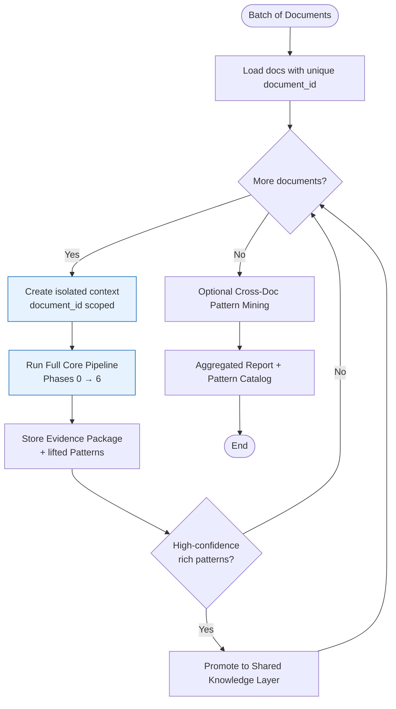
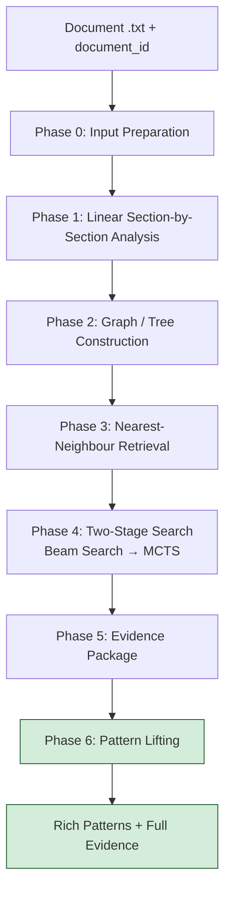

# End-to-End Implementation Plan
## Reverse-Engineering Ground-Truth Patterns from Wholesale Credit Agreements

**Version 2.0**  
**Date: 2026-08-25**

---

## 1. Ultimate Goal & Intention

### What we are actually solving

We are **not** trying to predict or extract a value from scratch.  
We already know the ground-truth value (example: `risk-type = cITCO- high risk`).

Our real intention is:

> Discover the **rich, reusable patterns** that explain *how* that ground-truth value was produced from the document.

A successful pattern must clearly show:

- Which **sub-entities** (and their exact values) were used
- **Where** in the document each sub-entity was found (section + location)
- The **description / context** of those sections
- What **transformations** were applied
- How the pieces were **combined**
- A short explanation of **why** this produces the ground-truth value (the intention)

The final output of the system is not just a reconstructed string.  
It is a set of high-quality, evidence-backed **Patterns** that a human or another system can understand, reuse, and trust.

### Scope

- Single document or batch of 10–15 documents
- Same `entity_name` can appear across documents with different or identical ground-truth values
- Documents are processed in **strict isolation**. Results from one document never contaminate another during search.

---

## 2. Core Design Principles

1. **Ground truth is the north star**  
   Every search and scoring decision is judged by how well it explains the known ground-truth value.

2. **Patterns are the real deliverable**  
   We optimize for rich, interpretable, reusable patterns — not just string reconstruction.

3. **Evidence must be traceable**  
   Every value in a pattern must point back to a specific section, span, and description in the document.

4. **Documents stay isolated**  
   No raw signals or intermediate results cross document boundaries during the core pipeline.

5. **Hybrid & controllable**  
   Deterministic structure + targeted LLM use. Explicit control flow (suitable for LangGraph / state machines).

6. **Search is reverse-engineering, not generation**  
   We search for the most plausible derivation path that could have produced the known answer.

---

## 3. High-Level Architecture

### 3.1 Multi-Document Orchestration



### 3.2 Single-Document Core Pipeline



---

## 4. Detailed Phases

### Phase 0 – Input Preparation

**Purpose**  
Clean the document and attach the isolation key.

**Steps**
- Accept one or more `.txt` credit agreements
- Assign a unique `document_id` to each
- Normalize whitespace while preserving headings and paragraph structure
- Attach metadata (bank, facility type, date — optional)

**Why this exists**  
Everything downstream is scoped by `document_id`. This is the foundation of strict isolation.

---

### Phase 1 – Linear Section-by-Section Analysis

**Purpose**  
Walk the document exactly as a careful human would: from first heading to last paragraph, writing a short analysis for every meaningful unit.

**Steps**
1. Detect hierarchical structure (headings → subsections → paragraphs)
2. For each unit:
   - Extract title and full text span
   - Generate a short analysis note (3–6 sentences) that answers:
     - What is this section about?
     - Does it contain risk language, administrator names, classifications, or defined terms?
     - Any potential values that could later become sub-entities?
3. Record preliminary signals (candidate phrases)

**Output per section**
- `section_id`, level, parent, character spans
- `short_analysis` (the human-style note)
- `raw_text`
- `preliminary_signals`

**Why this exists**  
This matches the human process you described. The short analysis becomes crucial later for rich patterns (we need the *description* of where a value lived, not just the value itself).

**Implementation note**  
Heading detection is deterministic. Short analysis is produced by an LLM under a strict, factual system prompt.

---

### Phase 2 – Graph / Tree Construction

**Purpose**  
Turn the linear analysis into a traversable structure that supports retrieval and later evidence linking.

**Structure**
- Primary: Tree (mirrors document hierarchy)
- Secondary: Light graph edges for cross-references (defined terms, “see Schedule X”, etc.)

**Node contents**
```json
{
  "id": "sec_4_1_2",
  "document_id": "doc_007",
  "title": "Appointment of Administrator",
  "level": 3,
  "parent_id": "sec_4_1",
  "short_analysis": "...",
  "raw_text": "...",
  "signals": ["Citco", ...],
  "embedding": [...],
  "relevance_score": null
}
```

**Why a graph/tree?**
- Credit agreements are hierarchical and full of cross-references
- Makes nearest-neighbour retrieval and later provenance easy
- Keeps the process explicit and inspectable
- Matches the “traversable easy-search graph” you originally wanted

**Storage**  
In-memory for prototyping; Postgres + pgvector (or equivalent) for production. Every node is keyed by `document_id`.

---

### Phase 3 – Nearest-Neighbour Retrieval (Candidate Generation)

**Purpose**  
Given the entity name + ground-truth value, pull the most promising raw pieces from the document graph.

**What happens**
1. Build a query from `entity_name` + `ground_truth` (e.g. `risk-type` + `cITCO- high risk`)
2. Retrieve top sections using:
   - Embedding similarity
   - Keyword / BM25 overlap
   - Hierarchical boost (prefer risk-related or administrator-related sections)
3. Prune clearly irrelevant sections
4. Extract **candidate sub-entities** from the surviving sections

**Expected output**  
A ranked list of rich candidate sub-entities (see data model below).

**Why this phase exists**  
Without it the later search would drown in noise. Nearest-neighbour acts as a smart filter that surfaces only the pieces that have a realistic chance of explaining the ground truth.

---

### Phase 4 – Two-Stage Search (Beam Search → MCTS)

**Purpose**  
Search for the combination of sub-entities + transformations that best reconstructs the ground-truth value and forms a coherent pattern.

#### Why two stages?

| Stage | Algorithm     | Role                                      | Why chosen |
|-------|---------------|-------------------------------------------|----------|
| 1     | Beam Search   | Fast primitive search                     | Quickly finds strong short combinations and reduces the space |
| 2     | MCTS          | Deeper, more exploratory search           | Better at discovering non-obvious orderings and transforms; can recover from early weak-looking paths |

**Beam Search first (primitive)**  
- Keeps only the top-K partial combinations at every step
- Fast and controllable
- Produces good candidate partial paths and a reduced set of useful signals

**MCTS second (main search)**  
- Uses the Beam results as a warm start
- Performs full Selection → Expansion → Simulation → Backpropagation
- Explores more deeply and records richer derivation paths

**Why MCTS?**  
Because the space of combinations + transforms can grow, and we need controlled exploration. MCTS balances trying new ideas with focusing on promising ones, and the resulting tree is inspectable.

**Why Beam before MCTS?**  
Pure MCTS on a large noisy set of signals is slower. Beam Search acts as a cheap, high-precision filter and warm-start so MCTS can focus its budget where it matters.

**Reward / Scoring function** (used by both, especially MCTS)

```text
reward = 
    w1 * string_similarity(reconstructed, ground_truth)
  + w2 * token_coverage
  + w3 * semantic_similarity
  + w4 * context_coherence          # do section descriptions support the roles?
  + w5 * structural_clarity         # clean roles, low complexity
  + w6 * intention_match            # does the explanation make sense?
  - w7 * complexity_penalty
```

The addition of `context_coherence` and `intention_match` is deliberate — pure string match is not enough for our goal.

**Allowed transforms** (discovered and recorded, not only applied)
- Case normalization (`Citco` → `cITCO`)
- Concatenation patterns (`A + "- " + B`, etc.)
- Light cleaning
- LLM-proposed transforms when deterministic ones are insufficient

---

### Phase 5 – Evidence Package

**Purpose**  
Package the best derivation paths found by the search with full provenance.

For each high-scoring path record:
- Reconstructed string
- Ordered list of sub-entities used
- Exact transforms applied
- Source sections
- Score breakdown
- Human-readable explanation

This is still document-scoped and intermediate.

---

### Phase 6 – Pattern Lifting (Critical New Phase)

**Purpose**  
Turn the best derivation paths into **rich, reusable Patterns** — the real deliverable.

This is where we close the gap between “we found a good path for this document” and “we have a pattern that captures values, location, description, transforms, and intention.”

**What a lifted Pattern contains**

```json
{
  "pattern_id": "pat_017",
  "document_id": "doc_007",
  "target_entity": "risk-type",
  "reconstructed_value": "cITCO- high risk",
  "confidence": 0.94,
  "structure": "normalize(administrator) + '- ' + risk_level",
  "components": [
    {
      "role": "administrator",
      "raw_value": "Citco",
      "normalized_value": "cITCO",
      "source_section_id": "sec_4_1_2",
      "section_title": "Appointment of Administrator",
      "section_description": "Appoints Citco as the fund administrator...",
      "local_context": "The Administrator shall be Citco Fund Services...",
      "evidence_score": 0.89
    },
    {
      "role": "risk_level",
      "raw_value": "high risk",
      "normalized_value": "high risk",
      "source_section_id": "sec_7_3",
      "section_title": "Risk Classification",
      "section_description": "Defines the internal risk category of the Borrower as High Risk",
      "local_context": "The Borrower is classified as high risk...",
      "evidence_score": 0.91
    }
  ],
  "transforms_applied": [
    "case_normalize(Citco → cITCO)",
    "concat_with_hyphen_space"
  ],
  "intention_summary": "The value is formed by taking the appointed administrator name, normalizing its casing to the internal convention cITCO, and appending the risk classification found in the risk section."
}
```

**Why this phase is mandatory**  
Without it we only have per-document explanations. With it we produce the exact artifact our ultimate goal requires.

---

## 5. Core Data Models

### Sub-Entity (first-class)

```text
Sub-Entity {
  role                  // administrator, risk_level, ...
  raw_value
  normalized_value
  source_section_id
  section_title
  section_description   // from Phase 1 short analysis
  local_context         // surrounding sentences
  evidence_score
  span
}
```

### Pattern (the real output)

```text
Pattern {
  pattern_id
  document_id
  target_entity
  reconstructed_value
  confidence
  structure             // combination recipe
  components            // list of Sub-Entities
  transforms_applied
  intention_summary     // natural language explanation of the “why”
}
```

---

## 6. Multi-Document Knowledge Sharing

### Strict Isolation Rule
During Phases 0–6 a document never sees another document’s raw signals, graph, or MCTS state.

### What may be shared (only after a document finishes)
Only high-confidence **rich Patterns** (and the transforms / role mappings they contain) may be promoted to the Shared Knowledge Layer.

### How later documents are helped
When a new document runs, the search may consult the Shared Knowledge Layer for:
- Previously successful transforms
- Known good role mappings
- Structural patterns that worked before

This is guidance only, never hard contamination.

### Why we share rich patterns (not basic templates)
Basic templates such as `admin + risk_level` lose location, description, and intention.  
Rich patterns carry the full evidence a later system (or human) actually needs.

---

## 7. Why These Algorithms & Design Choices

| Choice                        | Reason |
|-------------------------------|--------|
| Section-by-section + short analysis | Matches the human reverse-engineering process you described; produces the descriptions we need inside patterns |
| Graph / Tree                  | Natural fit for hierarchical legal documents; enables retrieval + clean provenance |
| Nearest-Neighbour Retrieval   | Filters noise so the search only considers plausible pieces |
| Beam Search first             | Fast, controllable way to surface strong short combinations and shrink the search space |
| MCTS second                   | Superior exploration of combinations + transforms; produces an inspectable tree; better for discovering non-obvious derivations |
| Multi-objective reward with intention & context terms | String match alone is insufficient for our goal |
| Explicit Pattern Lifting phase | Turns one-off derivations into the reusable rich patterns that are the actual objective |
| Strict document isolation + delayed sharing | Prevents contamination while still allowing useful learning across 10–15 documents |

---

## 8. Success Criteria

A run is considered successful when:

1. The system produces one or more rich Patterns for the given entity + ground truth
2. Each Pattern contains clear sub-entities with values, source sections, and descriptions
3. The transforms and combination structure are explicit
4. The `intention_summary` is human-interpretable and correct
5. The reconstructed value closely matches (or exactly matches) the ground truth
6. A human reviewer can look at the Pattern and immediately understand *how* and *why* the ground-truth value was formed

---

## 9. Implementation Roadmap

**Sprint 1 – Foundation**
- Phase 0 & 1 (section splitting + short analysis)
- Phase 2 (graph construction)
- Basic embedding + storage with `document_id`

**Sprint 2 – Retrieval & Search Core**
- Phase 3 (nearest-neighbour + candidate sub-entities)
- Beam Search implementation
- MCTS implementation with warm-start from Beam
- Multi-objective reward function

**Sprint 3 – Pattern Lifting & Rich Models**
- Full Sub-Entity and Pattern data models
- Phase 5 & Phase 6
- Intention summary generation

**Sprint 4 – Multi-Doc & Hardening**
- Batch runner with strict isolation
- Shared Knowledge Layer (rich patterns only)
- Evaluation harness against the success criteria above
- Human review interface for pattern promotion

---

## 10. Evaluation Metrics

- Exact / near-exact reconstruction rate of ground truth
- Pattern completeness (all required fields present)
- Human judgment of intention_summary quality
- Traceability (every value links to a real section)
- Cross-document pattern usefulness (does a promoted pattern help later documents?)
- Average number of sub-entities needed (prefer simpler coherent patterns)

---

## 11. Final Notes

This plan is deliberately built around the real intention:

> Find the values, the combinations, the transformations, the locations, and the descriptions that together explain the ground-truth value — and package them as rich, reusable Patterns.

Every phase, algorithm choice, and data model exists to serve that goal.  
Nothing important discussed in our conversation has been left out.

---

*Document version: 2.0*  
*Complete rewrite aligned with ultimate goal of rich pattern discovery*  
*Includes Beam → MCTS rationale, rich Sub-Entity & Pattern models, Pattern Lifting, multi-doc isolation, and intention-aware scoring*
