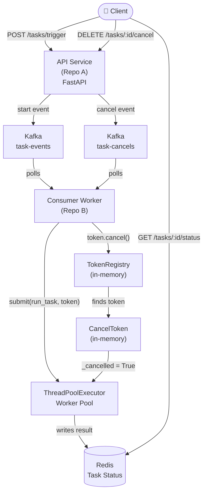
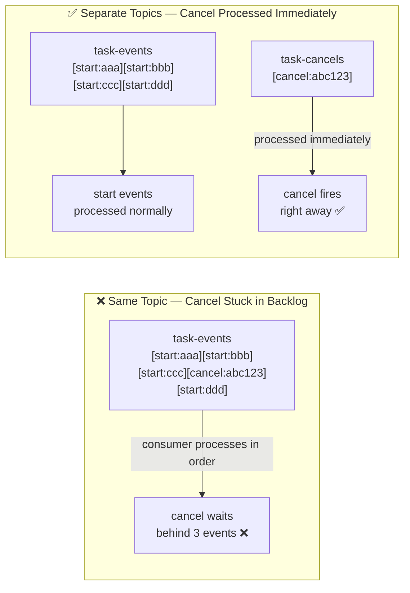
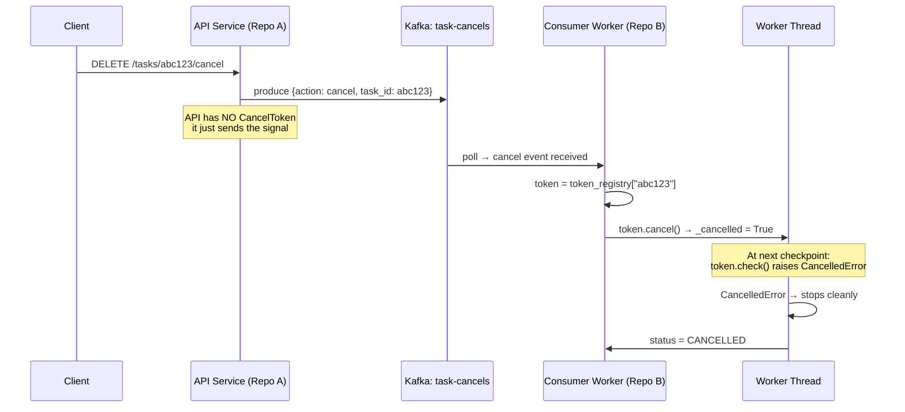
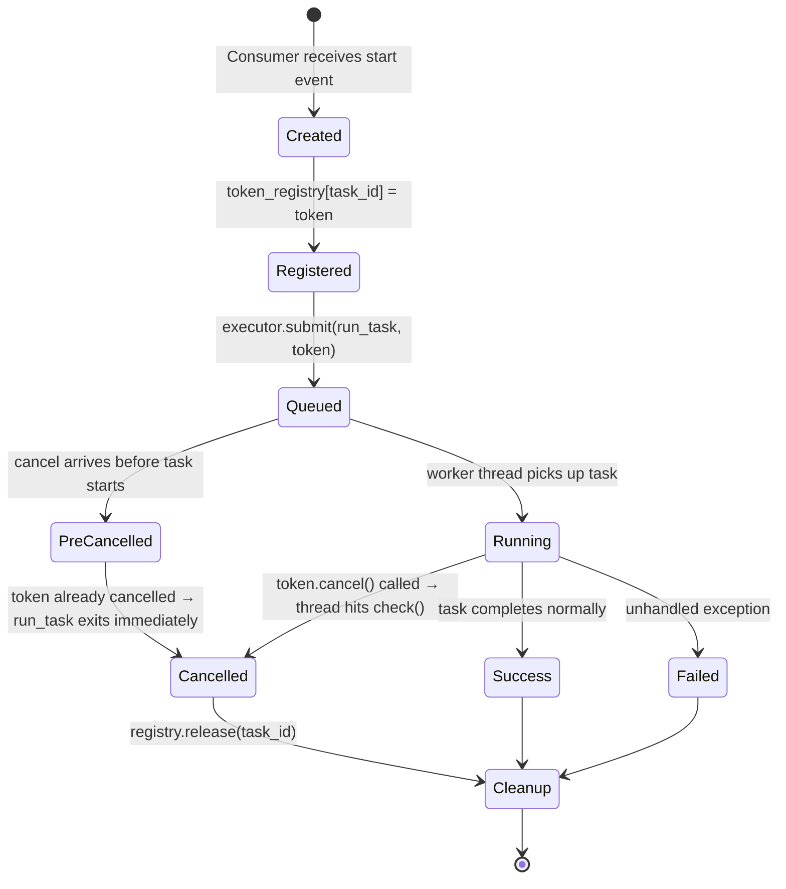
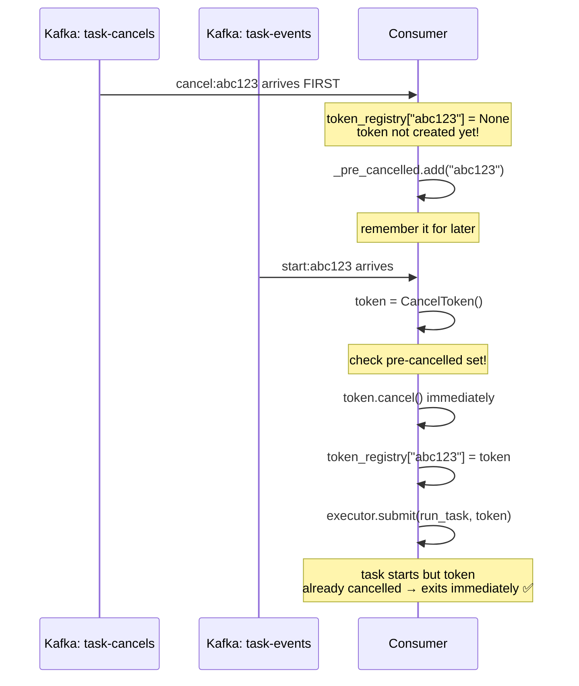
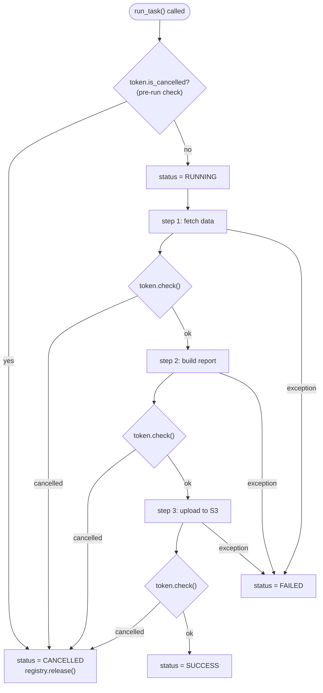
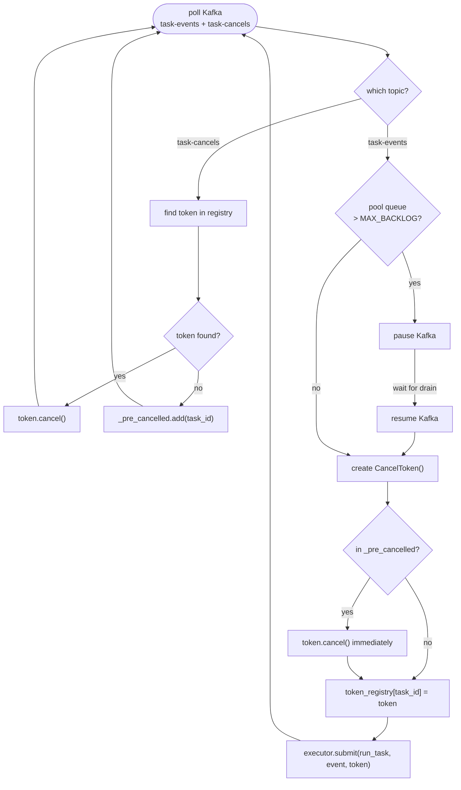
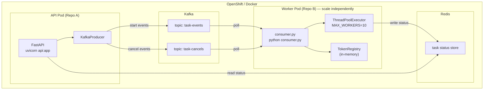
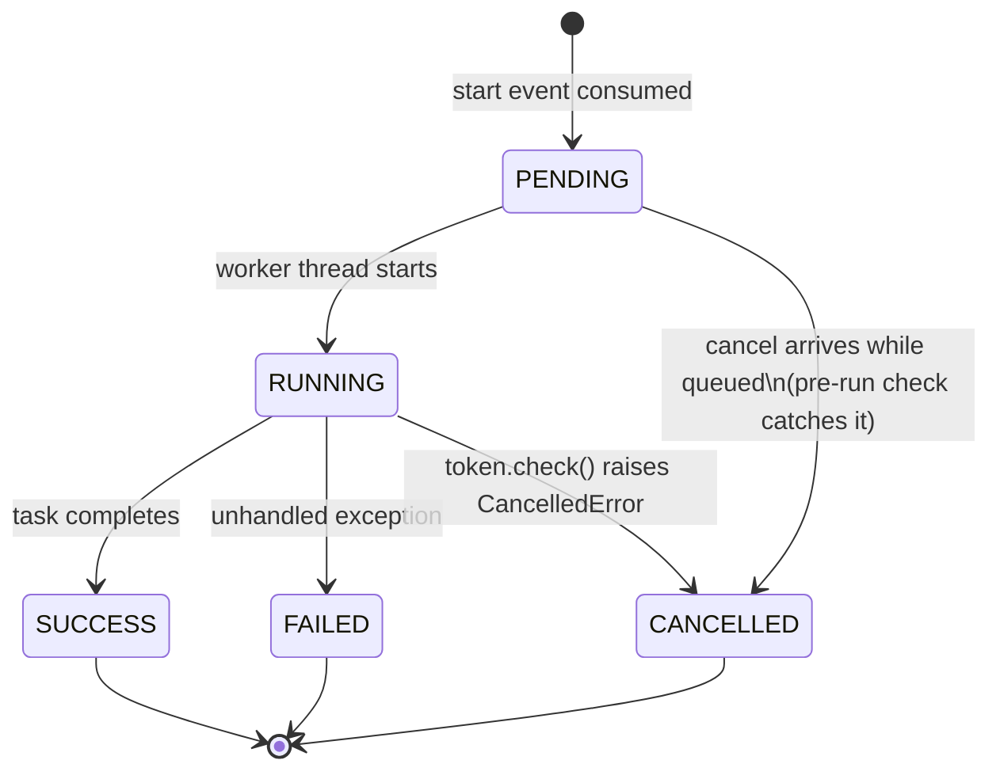

# Kafka Cancel Token Architecture

## Overview

A distributed task cancellation system using two Kafka topics and an in-memory CancelToken pattern.
The API service (Repo A) and the Consumer Worker service (Repo B) are completely separate processes.
Cancellation signals cross the process boundary via a dedicated Kafka topic.

---

## High-Level Architecture

---

## Two Kafka Topics — Why?

---

## Process Boundary — How Signal Crosses Repos

---

## CancelToken Lifecycle

---

## Ordering Edge Case — Cancel Arrives Before Start

---

## Worker Thread — Cooperative Cancellation

---

## Consumer Main Loop

---

## Deployment — Two Separate Services

---

## Task Status State Machine

---

## Component Responsibilities

| Component | Lives In | Responsibility |
|---|---|---|
| `api.py` | Repo A | Receive HTTP requests, produce Kafka events |
| `KafkaProducer` | Repo A | Send start/cancel events to correct topics |
| `consumer.py` | Repo B | Poll both topics, route start vs cancel |
| `CancelToken` | Repo B (in-memory) | Flag object shared between consumer loop and worker thread |
| `TokenRegistry` | Repo B (in-memory) | Map task_id → live CancelToken |
| `tasks.py` | Repo B | Business logic with `token.check()` checkpoints |
| `Redis` | Shared | Task status store readable by both repos |
| `task-events` topic | Kafka | Carries start payloads |
| `task-cancels` topic | Kafka | Carries cancel signals — processed with priority |

---

## Key Rules

1. **CancelToken never leaves Repo B** — it is purely in-memory within the consumer process
2. **Kafka is the only bridge** between Repo A and Repo B
3. **Partition key = task_id** on producer — ensures ordering per task
4. **Always call `token.check()`** at the start of `run_task()` to catch pre-cancelled tasks
5. **`_pre_cancelled` set** handles the race where cancel arrives before start
6. **`registry.release()`** in `finally` block — always clean up tokens
7. **Scale worker pods freely** — each pod has its own in-memory registry, Kafka handles partition assignment
